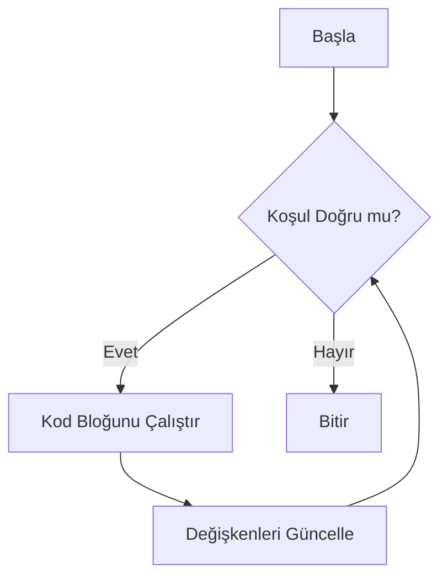

# Bölüm 2: Araştırma Görevi (While Döngüsü)

## 1. While Döngüsü Nedir?

While döngüsü, programlamada en temel döngü yapılarından biridir. Belirli bir koşul DOĞRU (TRUE) olduğu sürece içindeki kod bloğunu tekrar tekrar çalıştırır.

### Temel Sözdizimi (Syntax):
```python
while koşul:
    # Yapılacak işlemler
    # Kod bloğu
```

## 2. While vs For Döngüsü: Farklar Nelerdir?

### While Döngüsü:
* Koşul odaklıdır
* Ne zaman biteceği önceden belli olmayabilir
* Sayaç kullanılacaksa manuel artırılması gerekir
* Sonsuz döngü riski vardır (dikkatli olunmalı!)

### For Döngüsü:
* Dizi (liste, tuple vb.) üzerinde gezinmek için idealdir
* Kaç kere döneceği bellidir
* Sayaç otomatik artar
* Sonsuz döngü riski yoktur

## 3. While Döngüsü Ne Zaman Kullanılır?

### a) Kullanıcı Girişi Kontrolünde:
```python
# Örnek 1: Şifre kontrolü
sifre = "1234"
giris_hakki = 3

while giris_hakki > 0:
    tahmin = input("Şifreyi giriniz: ")
    if tahmin == sifre:
        print("Giriş başarılı!")
        break
    giris_hakki -= 1
    print(f"Kalan hakkınız: {giris_hakki}")
```

### b) Oyun Geliştirmede:
```python
# Örnek 2: Basit sayı tahmin oyunu
import random

hedef_sayi = random.randint(1, 100)
tahmin_hakki = 5

while tahmin_hakki > 0:
    tahmin = int(input("1-100 arası bir sayı tahmin edin: "))
    if tahmin == hedef_sayi:
        print("Tebrikler! Doğru tahmin!")
        break
    elif tahmin < hedef_sayi:
        print("Daha büyük bir sayı deneyin")
    else:
        print("Daha küçük bir sayı deneyin")
    tahmin_hakki -= 1
```

### c) Veri Doğrulamada:
```python
# Örnek 3: Geçerli not girişi
while True:
    not_degeri = int(input("0-100 arası not giriniz: "))
    if 0 <= not_degeri <= 100:
        print(f"Girilen not: {not_degeri}")
        break
    print("Geçersiz not! Tekrar deneyin.")
```

## 4. While Döngüsünün Çalışma Mekanizması

### Akış Şeması:


### Önemli Kavramlar:

1. **Koşul**: 
   * Her tekrarda kontrol edilir
   * True/False değer döndürmelidir
   * Yanlış olduğunda döngü sonlanır

2. **Sonsuz Döngüden Kaçınma**:
   * Sayaç kullanıyorsak artırmayı unutmamak
   * Break kullanımını bilmek
   * Koşulun bir noktada False olacağından emin olmak

3. **Break ve Continue**:
```python
# Break örneği
i = 1
while i <= 10:
    if i == 5:
        break  # 5'te döngüyü kırar
    print(i)
    i += 1

# Continue örneği
i = 0
while i < 5:
    i += 1
    if i == 3:
        continue  # 3'ü atlar
    print(i)
```

## 5. Pratik Örnekler ve Alıştırmalar

### Örnek 1: Faktöriyel Hesaplama
```python
sayi = 5
faktoriyel = 1
sayac = 1

while sayac <= sayi:
    faktoriyel *= sayac
    sayac += 1
print(f"{sayi}! = {faktoriyel}")
```

### Örnek 2: ATM Simülasyonu
```python
bakiye = 1000
while True:
    print("\n1. Bakiye Sorgula")
    print("2. Para Çek")
    print("3. Çıkış")
    
    secim = input("İşlem seçiniz: ")
    
    if secim == "1":
        print(f"Bakiyeniz: {bakiye} TL")
    elif secim == "2":
        miktar = int(input("Miktar: "))
        if miktar <= bakiye:
            bakiye -= miktar
            print("İşlem başarılı")
        else:
            print("Yetersiz bakiye")
    elif secim == "3":
        print("İyi günler!")
        break
```

## 6. Önemli İpuçları

1. Her while döngüsünde koşulun bir noktada False olacağından emin olun
2. Sayaç kullanıyorsanız mutlaka güncellemeyi unutmayın
3. Gerektiğinde break kullanmaktan çekinmeyin
4. Karmaşık koşullarda döngü öncesi plan yapın
5. Test verilerle döngünüzü kontrol edin

## 7. Sık Yapılan Hatalar

* Sonsuz döngüye girmek
* Sayaç güncellemeyi unutmak
* Koşulu yanlış yazmak
* Break/continue kullanımını karıştırmak
* Döngü içinde değişkenleri yanlış güncellemek
