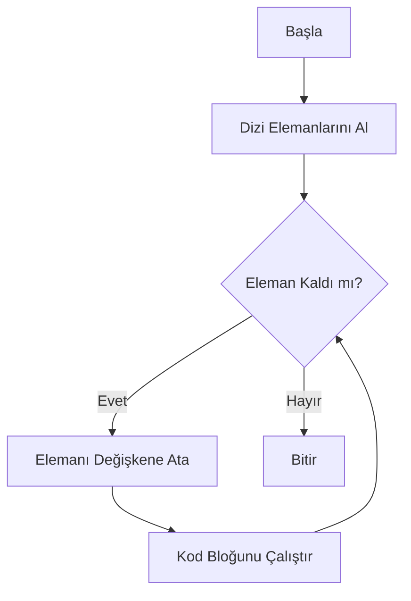
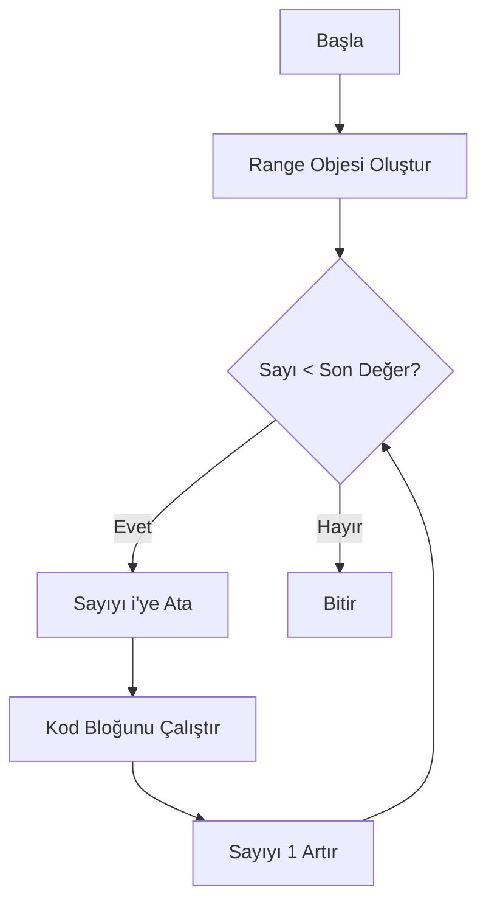

# For Döngüsünün Çalışma Mekanizması

## 1. For Döngüsünün Temel Yapısı

```python
for değişken in dizi:
    # İşlemler
```

## 2. Çalışma Adımları

1. Döngü başlangıcında dizi (sequence) okunur
2. Dizinin ilk elemanı değişkene atanır
3. Kod bloğu çalıştırılır
4. Bir sonraki elemana geçilir
5. Dizi bitene kadar 2-4 adımları tekrarlanır
6. Dizi bitince döngüden çıkılır

## 3. Akış Şeması



## 4. Örnek Üzerinden İnceleme

```python
meyveler = ["elma", "armut", "muz"]
for meyve in meyveler:
    print(meyve)
```

### Adım Adım Çalışması:

1. `meyveler` dizisi okunur: `["elma", "armut", "muz"]`
2. İlk eleman `"elma"` değişkene atanır
3. `print(meyve)` çalıştırılır -> "elma" yazdırılır
4. İkinci eleman `"armut"` değişkene atanır
5. `print(meyve)` çalıştırılır -> "armut" yazdırılır
6. Son eleman `"muz"` değişkene atanır
7. `print(meyve)` çalıştırılır -> "muz" yazdırılır
8. Başka eleman kalmadığı için döngü sonlanır

## 5. Range ile Kullanımı

```python
for i in range(3):  # range(3) = [0, 1, 2]
    print(i)
```

### Range Akış Şeması:


